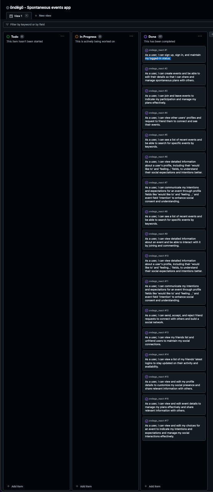

# öndëgö | README

## Overview

**öndëgö** is a spontaneous event planning application that allows users to create and join events with friends **on the go**. The application allows users to create events anytime in the future but we designed optimizing it with a simple and intuitive interface to encourage users to create an event with typing just a few fields. **öndëgö** prepopulates the date and time for the same day 'after work' hours and in case you didn't have time for a picture, we have a funky default image for you. Encouraging you to meet your friends more often through making the effort of creating an event as minimal as possible.
  - You have just left work and wouldn't mind company to that concert tonight? Create an event

**öndëgö** includes a set of micro-consent simple stratagies with a 'feeling' and 'would like to' fields in the user profile, as well as an 'ending time' expectation  and 'intentions' field in the event creation. Like this, we aim to help friends understand each other's mood and intentions and balance it with the ones of the others in the group. If you are tired from work you can still invite your friends to a concert but have a frame to hint that you might not have the energy to have that extra drink after the concert. We believe that this will help friends to understand each other better and make the experience more enjoyable for everyone. And help you dare to meet your friends more often without being afraid of commiting to something bigger than you can handle. 

**öndëgö** is a full-stack application built with Django REST Framework and React. It features user authentication, event creation, event joining, and friend requests. The application is deployed on Heroku and uses ElephantSQL for the PostgreSQL database.

## Features

### 1. Profile

- **User Profile**: When a user is created through the Django Allauth registration process, a complementary profile is created that allows the user to add a profile picture, a custom name and additional fields such as 'feeling' and 'would like to' to help friends understand their mood and intentions. Profiles are created with a default alien avatar image, and empty fields for 'feeling' and 'would like to'. Empty fields are optional and are not displayed if the user does not fill them in.

- **Edit Profile**: Users can update their profile information, including their profile picture which substitutes the default alien avatar image, custom name, and additional fields such as 'feeling' and 'would like to' to better represent their mood and intentions.

### 2. Friends

- **Friend Requests**: Users can send friend requests to connect with other users. When a user sends a friend request, the recipient receives a notification and can choose to accept or decline the request. If the request is accepted, the users become friends and can view each other's events and profiles. If the request is declined, the users remain unconnected.

- **Friends**: When a friend request is accepted, two instances of the 'Friend' model are created to represent the relationship between the users. Users can see all profiles to be able to send friend requests and view their friends' profiles to see their latest logins, but users can only see the events of their friends for privacy reasons.

- **Latest Friends' Logins**: Users can view a list of their friends' latest logins. This feature allows users to stay updated on their friends' activity and availability, making it easier to plan and coordinate events as well as friend, unfriend and manage friend requests.

- **Unfriending**: Users can unfriend other users to manage their social connections. When a user unfriends another user, the 'Friend' instances representing the relationship between the users are deleted, and the users are no longer connected.

### 3. Events

- **Event Creation**: Users can create events by providing a title, description, location, start and end date and time, and an image. The application prepopulates the date and time for the same day 'after work' hours, since those are the most common after work hours, potentially diminishing the effort of creating an event and encouraging users to meet their friends more often. When a user doesn't have time to upload a picture, the application provides a default image. The event creation form also includes an 'intentions' field to help friends understand the user's expectations for the event, as well as the possibility to add a link in case the event is happening in a different platform or more information can be found for example in a ticketing website.

- **Edit and Delete Events**: Event owners can edit and delete their events. When editing an event, the form is prepopulated with the event's current details, allowing the owner to make changes as needed. The owner can also delete the event if they no longer wish to host it. 

- **Event Joining**: The application also includes three choices for the user to express their intentions for the event: 'Joining', 'let_me_think', and 'not_joining'. Users can select one of these choices to indicate their attendance status. The application displays the number of users who have joined the event, as well as the number of users who are still thinking about it. This feature helps friends understand each other's intentions and expectations for the event, making it easier to plan and coordinate.

- **Event Detail Page**: Users can view detailed information about an event, including the title, description, location, start and end date and time, image, creator, and intentions. The event detail page also includes a comments section where users can add comments to share thoughts or ask questions about the event. The application displays the number of users who have joined the event, as well as the number of users who are still thinking about it. This feature helps friends understand each other's intentions and expectations for the event, making it easier to plan and coordinate.

- **Comments**: Users can add comments to events to share thoughts or ask questions about the event. The comments section allows users to interact with each other and engage in conversations related to the event. This feature helps friends communicate and coordinate their plans more effectively.

### 4. Search

- **Search Events**: Users can search for events using user and title keywords. The application filters the events based on the search query, displaying only the events that match the search criteria. This feature helps users find events of interest quickly and easily.

### 5. All events homepage and Going on and Joining Events filtered list

- **All Events Feed**: Users can view a list of the most recent events on the homepage. The feed displays the events in descending order of creation date, with the most recent events appearing at the top. The feed includes a search bar where users can search for events using keywords. This feature helps users discover new events and stay updated on the latest activities.

- **Going on and Joining Events Feed**: Users can view a list of events they are joining as well as events going on or starting in the upcoming two hours. This feature helps users stay updated on their plans and coordinate with friends more effectively allowying for quick decisions and last minute plans.

### 6. User Authentication

- **User Registration**: Users can sign up for a new account by providing an email address and password. The application sends a verification email to the user to confirm their account.

- **User Login**: Users can sign in to the application using their email address and password. The application verifies the user's credentials and logs them in if they are correct.

- **User Logout**: Users can log out of the application to end their session and protect their account from unauthorized access.

- **User Session Management**: The application maintains the user's logged-in status until they choose to log out explicitly. The application also refreshes access tokens automatically to ensure the user's session remains active.

## Design

### Establishing **Öndëgö**'s Visual Identity

As Öndëgö took shape, I envisioned a design that harmonized playfulness with sobriety, evoking a sense of intrigue and vibrancy. The app's interface features backgrounds in variations of black and very dark grey, lending an eerie yet captivating ambiance. Against this backdrop, fonts in secondary vibrant colors — orange, purple, and green — punctuate the darkness with neon vibes, striking a balance between whimsy and sophistication.

### Logo

In the journey of shaping Öndëgö's visual identity and its logo, I turned to the playful and quirky Platypi font from Google Fonts. With the help of the Google Fonts to SVG Path online tool, I transformed the text outline into a vector graphic (SVG) to give Öndëgö its unique mark.

The process began with selecting Platypi, a playful and quirky Google Font, to reflect Öndëgö's essence. I crafted the outline of the app's name using the Platypi font. The rounded shapes and whimsical charm of Platypi perfectly encapsulated the spirit of Öndëgö, setting the foundation for its visual identity.

To transform the Platypi text into a scalable vector graphic (SVG), I turned to [Google Font to SVG Path](https://danmarshall.github.io/google-font-to-svg-path/), a tool capable of converting text to SVG paths. I then captured the SVG vectors as a design feature.

Next, using [Canva](https://www.canva.com/), I converted the file to a PNG with a transparent background.

Overall, your version effectively communicates your process. These suggestions are merely to enhance clarity and readability. Great work!

### Font Selection

Öndëgö's font selection embodies a delicate balance between friendliness and authenticity, without straying into gimmickry. Each font choice contributes to the project's visual identity by infusing warmth and approachability into the design, while also maintaining a sense of genuine connection. Through Platypi, Mukta, and Padauk, Öndëgö aims to create an inviting and inclusive atmosphere where spontaneity thrives, fostering meaningful interactions among friends without resorting to artificiality or clichés.

## Primary Font: Platypi

**Platypi** was carefully chosen as the primary font for Öndëgö's branding and logo. Its playful and quirky appearance perfectly embodies the project's relaxed and informal vibe, injecting personality without veering into formality. With rounded shapes and a whimsical charm, Platypi sets the tone for Öndëgö's unique identity as a platform for spontaneous hangout activities among friends.

## Secondary Font: Mukta

**Mukta** serves as the secondary font, utilized for titles and navigation elements across Öndëgö. Balancing casualness with clarity, Mukta adds depth to the visual hierarchy while maintaining coherence with Platypi's playful demeanor. Its versatility complements the project's laid-back aesthetic, ensuring a cohesive and enjoyable user experience.

## Tertiary Font: Padauk

For body text and content, **Padauk** was selected as the tertiary font. Its light and airy design prioritizes readability and simplicity, allowing the focus to remain on the content while providing a comfortable reading experience. Padauk seamlessly integrates with the playful energy of Platypi and the relaxed tone of Mukta, completing Öndëgö's font palette.

## How to Use

### 1. Creating an Account

To get started with **öndëgö**, users can sign up for a new account by providing an username and a password. A profile is automatically created for the user, allowing them to customize their social presence and share relevant information with others. The user can also upload a profile picture, set a custom name, and add additional fields such as 'feeling' and 'would like to' to communicate their mood and intentions to friends.

### 2. Creating an Event

To create an event, users can provide relevant details such as title, description, location, start and end date and time, and an image. The application prepopulates the date and time for the same day 'after work' hours, since those are the most common after work hours, potentially diminishing the effort of creating an event and encouraging users to meet their friends more often. When a user doesn't have time to upload a picture, the application provides a default image. The event creation form also includes an 'intentions' field to help friends understand the user's expectations for the event, as well as the possibility to add a link in case the event is happening in a different platform or more information can be found for example in a ticketing website.

### 3. Joining an Event

To join an event, users can select one of three choices: 'Joining', 'let_me_think', and 'not_joining'. These choices allow users to express their intentions for the event and help friends understand their attendance status. The application displays the number of users who have joined the event, as well as the number of users who are still thinking about it. This feature helps friends understand each other's intentions and expectations for the event, making it easier to plan and coordinate.

### 4. Viewing Events

To view events, users can navigate to the homepage to see a list of the most recent events. The feed displays the events in descending order of creation date, with the most recent events appearing at the top. Users can also search for events using keywords to find events of interest. The application also includes a list of events the user is joining as well as events going on or starting in the upcoming two hours. This feature helps users stay updated on their plans and coordinate with friends more effectively, namely allowing for quick decisions and last minute plans with the going on events list, or to check quickly which events the user is joining.

### 5. Managing Friends

To send friend requests, users can view all profiles to be able to send friend requests and view their friends' profiles to see their latest logins. Users can send friend requests to connect with other users and accept or reject friend requests to manage their social network. When a friend request is accepted, the users become friends and can view each other's events and profiles. Users can also unfriend other users to manage their social connections. When a user unfriends another user, the 'Friend' instances representing the relationship between the users are deleted, and the users are no longer connected. The application also includes a list of the users' friends' latest logins, allowing users to stay updated on their friends' activity and availability. Users can see all profiles to be able to send friend requests and view their friends' profiles to see their latest logins, but users can only see the events of their friends for privacy reasons.

### 6. Viewing and Editing Profile

To view and edit their profile, users can navigate to the profile page to see detailed information about their profile, including their profile picture, custom name, and additional fields. Users can edit their profile details, including their profile picture, custom name, and additional fields, to customize their social presence and share relevant information with others. Users can also communicate their intentions and expectations for an event through profile fields like 'would like to' and 'feeling ...' to enhance social consent and understanding. This feature allows users to create a more inclusive and enjoyable social experience for everyone involved.

### 7. Viewing and Editing Event

To view and edit an event, users can navigate to the event detail page to see detailed information about the event, including the title, description, location, start and end date and time, image, creator, and intentions. The event detail page also includes a comments section where users can add comments to share thoughts or ask questions about the event. Users can edit the event details, including the title, description, location, start and end date and time, and image, to manage their plans effectively and share relevant information with others. Users can also communicate their intentions and expectations for an event through the event field 'intention' to enhance social consent and understanding.

### 8. Communicating Intentions and Expectations

To communicate intentions and expectations for an event, users can set their intentions and expectations for an event through profile fields like 'would like to' and 'feeling ...'. Users can view other users' intentions and expectations for an event through profile details and event information. This feature helps friends understand each other's mood and intentions, making it easier to plan and coordinate events effectively.

## Development User Stories

### Authentication

#### As a user, I can sign up, sign in, and maintain my logged-in status so that I can access the app's features seamlessly.

- **AC1:** Users can sign up for a new account.
- **AC2:** Users can sign in to the app.
- **AC3:** Users can stay logged in until they choose to log out explicitly.
- **AC4:** Access tokens are refreshed automatically to maintain the logged-in status.

### Creating and Updating Events

#### As a user, I can create events and be able to edit their details so that I can share and manage spontaneous plans with others.

- **AC1:** Users can create new events with relevant details such as title, date, time, location, and description.
- **AC2:** Event creators can edit event details like title, date, time, location, and description after creation.

### Joining Events

#### As a user, I can join and leave events to indicate my participation and manage my plans effectively.

- **AC1:** Users can join events to indicate their participation.
- **AC2:** Users can leave events if their plans change.

### Viewing Other Profiles

#### As a user, I can view other users' profiles and request to friend them to connect and see their events.

- **AC1:** Users can view other users' profiles.
- **AC2:** Users can send friend requests to connect with other users.

### Viewing Event List

#### As a user, I can see a list of recent events and be able to search for specific events by keywords.

- **AC1:** Users can view a list of most recent events.
- **AC2:** Users can search for events using keywords to find events of interest.

### Viewing Event Detail Page

#### As a user, I can view detailed information about an event and be able to interact with it by joining and commenting.

- **AC1:** Users can view detailed information about an event, including its title, date, time, location, description, and creator.
- **AC2:** Users can join an event to indicate their participation.
- **AC3:** Users can add comments to an event to share thoughts or ask questions.

### Viewing Profile Detail Page

#### As a user, I can view detailed information about a user's profile, including their 'would like to' and 'feeling...' fields, to understand their social expectations and intentions better.

- **AC1:** Users can view detailed information about a user's profile, including their 'would like to' and 'feeling...' fields.
- **AC2:** Users can understand the social expectations and intentions of other users through their profile details.

### Communicating Intentions and Expectations

#### As a user, I can communicate my intentions and expectations for an event through profile fields like 'would like to' and 'feeling ...' and event field 'intention' to enhance social consent and understanding.

- **AC1:** Users can set their intentions and expectations for an event through profile fields like 'would like to' and 'feeling ...'.
- **AC2:** Users can view other users' intentions and expectations for an event through profile details and event information.

### Managing Friend Requests

#### As a user, I can send, accept, and reject friend requests to connect with others and build a social network.

- **AC1:** Users can send friend requests to connect with other users.
- **AC2:** Users can accept or reject friend requests to manage their social network.

### Managing Friends

#### As a user, I can view my friends list and unfriend users to maintain my social connections.

- **AC1:** Users can view a list of their friends.
- **AC2:** Users can unfriend other users to manage their social connections.

### Viewing Latest Friends' Logins

#### As a user, I can view a list of my friends' latest logins to stay updated on their activity and availability.

- **AC1:** Users can view a list of their friends' latest logins.
- **AC2:** Users can stay updated on their friends' activity and availability through the latest logins list.

### Viewing and Editing Profile

#### As a user, I can view and edit my profile details to customize my social presence and share relevant information with others.

- **AC1:** Users can view their profile details, including their profile picture, custom name, and additional fields.
- **AC2:** Users can edit their profile details, including their profile picture, custom name, and additional fields.

### Viewing and Editing Event

#### As a user, I can view and edit event details to manage my plans effectively and share relevant information with others.

- **AC1:** Users can view event details, including the title, date, time, location, description, and owner.
- **AC2:** Event owner can edit event details, including the title, date, time, location, and description.

### Viewing and Editing Choices

#### As a user, I can view and edit my choices for an event to indicate my intentions and expectations and manage my social interactions effectively.

- **AC1:** Users can view their choices for an event, including 'joining', 'let_me_think', and 'not_joining'.
- **AC2:** Users can edit their choices for an event to update their intentions and expectations.

## Languages:

## Frameworks and Libraries

- **[React](https://reactjs.org/)**: React is a JavaScript library for building user interfaces. It allows developers to create reusable UI components and build complex user interfaces efficiently.

## Additional Dependencies

- **[React-Bootstrap](https://react-bootstrap.github.io/)**: React-Bootstrap is a front-end framework that provides pre-built components and styles for React applications. It allows developers to create responsive and mobile-friendly web interfaces with ease.

- **[Axios](https://axios-http.com/)**: Axios is a promise-based HTTP client for JavaScript that enables developers to make HTTP requests from the browser. It simplifies the process of sending asynchronous requests and handling responses.

- **[React-Router-Dom](https://reactrouter.com/web/guides/quick-start)**: React Router is a routing library for React that enables developers to create single-page applications with dynamic, client-side routing. It allows users to navigate between different pages without refreshing the browser.

### Other tools:

[VSCode:](https://code.visualstudio.com/) was used as the main tool to write and edit code.

[GitHub:](https://github.com/) was used to host the code of the website.

[Heroku:](https://id.heroku.com/login) Utilized for deployment and hosting of the web application, providing a scalable platform with integrated continuous delivery and deployment features.

[ElephantSQL: ](https://www.elephantsql.com/) Employed as the PostgreSQL database hosting service, offering a managed cloud database solution for storing and managing application data efficiently.

## Functionality

### Event Creation with Default Date and Time

In the development of the EventCreateForm component, I prioritized user experience by prepopulating the start and end times of an event with default values. This feature is particularly beneficial for users creating spontaneous events, a key focus of this application.

I set the start time (when_start) to default to today's date at 18:00 (6 PM), and the end time (when_end) to default to today's date at 23:00 (11 PM). These times were chosen as they typically represent after-work hours when most spontaneous events are likely to occur.

To achieve this, I created the getTodayAt function, which takes hours and minutes as parameters and returns a string representing the current date at the specified time.

    const getTodayAt = (hours, minutes) => {
        let date = new Date();
        date.setHours(hours);
        date.setMinutes(minutes);
        date.setSeconds(0);
        date.setMilliseconds(0);
        return date.toISOString().slice(0, 16);
    }

By prepopulating these fields, I've reduced the number of clicks and typing required by the user, making the event creation process quicker and more efficient. Even if users need to adjust the hours, they likely won't need to change the minutes or date, further enhancing their experience.

## Deployment

## Manual Testing

### User Authentication

#### Sign Up

- The user was able to sign up successfully using a valid email address and password.
- The user received a verification email after signing up.
- The user was able to verify their account by clicking the verification link in the email.

#### Sign In

- The user was able to sign in successfully using their email address and password.
- The user was redirected to the homepage after signing in.

#### Log Out

- The user was able to log out successfully.
- The user was redirected to the sign-in page after logging out.

### Profile

#### View Profile

- The user was able to view their profile details, including their profile picture, custom name, and additional fields.
- The user's profile picture, custom name, and additional fields were displayed correctly.

#### Edit Profile

- The user was able to edit their profile details, including their profile picture, custom name, and additional fields.
- The user's profile details were updated successfully after editing.

### Events

#### Create Event

- The user was able to create a new event with relevant details such as title, date, time, location, and description.
- The event was displayed correctly on the homepage after creation.
- A picture was uploaded correctly and the default picture was displayed correctly when no picture was uploaded.
- The event was created with the correct date and time prepopulated for the same day 'after work' hours.

#### Edit Event

- The event owner was able to edit event details like title, date, time, location, and description after creation.
- The event details were prepopulated correctly in the edit form.
- The event image was prepopulated correctly in the edit form.
- The event details were updated successfully after editing.

#### Join Event

- The user was able to join an event to indicate their participation.
- The user's choice was displayed correctly on the event detail page.

#### Leave Event

- The user was able to leave an event if their plans changed.
- The user's choice was updated correctly on the event detail page.

#### View Event List

- The user was able to view a list of most recent events on the homepage.
- The events were displayed in descending order of creation date, with the most recent events appearing at the top.
- The events displayed joinings buttons and countings correctly.

#### View Event Detail Page

- The user was able to view detailed information about an event, including its title, date, time, location, description, creator, and intentions.
- The event detail page displayed the number of users who had joined the event and the number of users who were still thinking about it.

### Searchbar

#### Search Events

- The user was able to search for events using author user and title keywords.
- The events were filtered based on the search query, displaying only the events that matched the search criteria.

### Friends

#### Send Friend Request

- The user was able to send a friend request to connect with another user.
- The recipient received a notification through a change in the friend request button.

#### Accept Friend Request

- The user was able to accept a friend request to connect with another user.
- The users became friends and could view each other's events and profiles.
- The friend request button changed to an unfriend button.

#### Reject Friend Request

- The user was able to reject a friend request to remain unconnected with another user.
- The users remained unconnected and could not view each other's events but could renovate the friend request.

#### Unfriend User

- The user was able to unfriend another user.
- The users were no longer connected and could not view each other's events but could renovate the friend request.

#### View users latest logins

- The user was able to view a list of the users latest logins.
- The list displayed the users' profile pictures and custom names correctly.
- the list displayed the correct buttons for friend, unfriend and manage friend requests.

## Development notes

### Friends Functionality

I developed the friends functionality capable of representing four distinct states: 'friends', 'requested friendship', 'has friend request', and 'not friends'. The functionality uses a set of two models, 'Friend' and 'FriendRequest', to manage the relationships between users effectively. The 'Friend' model stores the relationships between users who are friends, while the 'FriendRequest' model manages the requests for friendship between users. This separation allows for clear and efficient management of the different states of friendship. More info on this in the API README.

In the frontend, I implemented the friends functionality using a series of conditional checks to determine the current user's relationship with the profile owner. Based on the relationship status, the app displays the appropriate button or message to the user, allowing them to interact with the profile owner accordingly. The functionality includes the ability to send friend requests, accept or decline friend requests, cancel friend requests, and unfriend users.

I've employed a layered nested ternary operators to handle the various states of friendship between the current user and the profile owner. This approach allows me to handle multiple conditionsrather than a binary bollean.

At the top level, I first check if the current user exists and is not the profile owner. If this condition is met, I then check if the current user is already friends with the profile owner using `profile?.is_friend`. Depending on the result, I render either an "Unfriend" or "Enquire Friendship" button. The "Enquire Friendship" button calls the `handleCreateFriendRequest` function, which sends a friend request to the profile owner.

If the current user is the profile owner, we enter another layer of conditions. I first check if the profile owner has a friend request from the current user using `profile?.has_friend_request`. If true, I render "Consent", "Not right now", and "Block" buttons. The "Consent" button triggers the `handleConsentFriendRequest` function, which accepts the friend request. The "Not right now" button triggers the `handleNotRightNowFriendRequest` function, which declines the friend request.

If the profile owner does not have a friend request from the current user, I check if the current user has requested friendship from the profile owner using `profile?.has_requested_friendship`. Depending on the result, I render either a "Cancel Request" or "Edit Profile" button. The "Cancel Request" button triggers the `handleCancelFriendRequest` function, which cancels the friend request.

Finally, if none of the above conditions are met, I render a "Add Friend" button, which triggers the `handleCreateFriendRequest` function to send a friend request to the profile owner.

## Resolved bugs

### Debugging the Add Event Image Upload Button

Initially, the Add Event Image Upload Button was not functioning as expected. The standard button appeared grey inside the customized orange button, which was not the desired behavior. The issue was that the browser's default file input button was not being styled correctly.

To resolve this issue, I implemented a common workaround for styling file inputs. I hid the actual file input and used a label to create a custom button. The label was associated with the file input using the `htmlFor` attribute, so clicking the label triggered the file input. This made the entire label, including the `Asset` component and the custom button text, act like a file upload button.

However, this initially resulted in two buttons being displayed due to the ternary operation in the code. To fix this, I used a second ternary operation to change the text of the same button, instead of having two separate buttons. This ensured that only one button was displayed at a time, with the text changing based on whether an image had been uploaded.

With these changes, the image upload button is now working as expected, with the correct styling and behavior.

### Debugging the Image Display in the add event

While working on the Create Event module, I encountered an issue where the image wasn't staying within its container. Initially, I thought the problem was with the CSS properties `max-width` and `max-height` that I had used. I tried setting defined heights and widths for the image and its parent containers, but this didn't solve the issue.

After investigating further, I realized that the problem wasn't with the CSS properties or with Bootstrap overwriting my custom CSS. The issue was that I was addressing the wrong element. The placeholder image was sourced from the assets module, not from the image tag. So, I needed to apply the sizing CSS code to both the image and the asset to get the same result with the placeholder and the image uploaded by the users.

After making this change, the image started responding as expected. However, there was still some work to be done. I noticed that the positioning style in the two levels of parents wasn't mirrored. So, I made sure to mirror the positioning style in the two levels of parents to ensure the image was displayed correctly within its container.

In conclusion, the image display issue in the Create Event module was resolved by addressing the correct element in the CSS and mirroring the positioning style in the two levels of parents. This served as a reminder that sometimes the issue isn't with the code you're focusing on, but somewhere often so evident it is hard to see!

### Debugging the EventCreateForm Component

The EventCreateForm component did not submit the placeholder image when no image was selected by the user. This was due to the `event_Image` state being set to `null` by default, which caused the placeholder image to be removed when the form was submitted without an image. To resolve this issue, I updated the `event_image` state to default to the placeholder image when no image was selected. This ensured that the placeholder image was submitted with the form when no image was selected by the user.

### Debugging Image Upload in EventCreateForm

I encountered still another issue with the image upload functionality. The problem was that when a user did not upload an image for an event, we wanted to send a default placeholder image to the server. However, the server was expecting an image file, not a URL. To resolve this issue, I updated the `event_image` state to store the image file when a user uploaded an image and the placeholder image URL when no image was uploaded. This allowed the form to submit the correct data to the server, ensuring that the placeholder image was displayed when no image was uploaded by the user. This resolved the issue and ensured that the image upload functionality worked as expected. 

The original code was:

    if (imageInput.current.files[0]) {
        formData.append('event_image', imageInput.current.files[0]);
    }

This code was checking if the user selected an image file. If they had not, it appended the file to the formData object. If they had not, it did nothing. This was causing an error because the server was expecting a file for the 'event_image' field.

To fix this, I researched a way to modify the code to fetch the placeholder image, convert it to a Blob, create a File object from the Blob, and append it to the formData object when the user does not upload an image. The updated code is:

    if (imageInput.current.files[0]) {
        formData.append('event_image', imageInput.current.files[0]);
    } else {
        const response = await fetch(Upload);
        const blob = await response.blob();
        const file = new File([blob], 'upload.jpg', { type: 'image/jpeg' });
        formData.append('event_image', file);
    }

In this updated code, Upload is the URL of the placeholder image and 'upload.jpg' is the filename.

This solution ensures that a file is always sent for the 'event_image' field, whether it's the user-uploaded image or the default placeholder image.

### Developing and Debugging Choices Functionality

The initial implementation of the choices functionality in Öndëgö involved  the adaptation of the CI walkthrough 'Like' example functionality to a more complex 'Joining' model capable of representing three distinct choices: 'Joining', 'let_me_think', and 'not_joining'. This transition required modifying the underlying data structure, updating the model, and implementing server-side logic to manage user choices effectively. I this process I incurred in seeralr bugs that I had to resolve.

First I tried to request the database for the joinings and calculate the counts of each choice in the frontend but soon I realized that this was not the best approach. I then shifted focus to server-side logic, annotating the counts of each choice in the view and returning the updated data to the frontend. This approach allowed me to manage the data more effectively and ensure consistency across user interactions. 

I have also had to work through how to preceed with the triangular filtering of the joing, user and event models. I had to create a new model to store the choices and then filter the choices by the user and event models. This was a complex process that required careful consideration of the relationships between the models and the data structure. It was a step-by-step process that involved creating the new model, updating the views, and implementing the necessary logic to filter the choices correctly. but I feel it was an important pragmatic exercise that took my understanding of how to store and access data inRest Framework and React to a new level. namely how to debug and resolve issues when working separately on the frontend and backend, wich is an exciting but also challenging process.

For this I went through an exhausitve process of debugging and testing the code, using console.log to check the data at each step and identify any issues. I also used the Django Rest Framework browsable API to inspect the data and verify that the choices were being stored correctly. This process helped me identify and resolve several bugs, including issues with the data structure, the model relationships, and the server-side logic, mostly related with how I was accessing and filtering wrongly certain specific data lacking or adding layers at times namely when accessing only one value of a model through the way it is registered as a key for another model and how to cross these keys

I ended up resolving the logic for the axios request to the backend first without state for clarity. I then added the state and the logic to update the state based on the response from the server. This approach allowed me to focus on one aspect of the functionality at a time and ensure that each part was working correctly before moving on to the next. I also used the React DevTools to inspect the state and verify that it was being updated correctly. This helped me identify and resolve several bugs related to the state management and the axios request.

I had some final issues because I was declaring the variable currentUserJoiningThisEvent after an if statement but I realized I needed to access it outside of the if statement to identify the user's choice for the event. This was a simple fix but it took me some time to identify the issue and resolve it. I also had to update the logic for the axios request to the backend to include the user's choice in the request data. This required updating the data structure and the server-side logic to handle the new field correctly. I also had to update the frontend logic to update the state based on the user's choice and display the correct information to the user. This was a complex process that required careful consideration of the data structure and the relationships between the models. I had to work through several bugs and issues to get the functionality working correctly, but I feel that the final result is a robust and reliable system that effectively manages user choices for events.
Finally, I encountered an error with the subtraction operation. The issue was that the count of each choice was not decreasing correctly when a user changed their choice although I had that subtraction. I understood finally that although the new choice, used to add 1, was passed to me through the event the click, the previous choice was being unpacked on mount and not updated. So I understood I needed to initiate it to use and store state to be able to update it. I then updated the logic to update the state based on the user's choice and display the correct information to the user. This was a process that took some work and consideration of the data structure and the relationships between the models. I had to work through several bugs and issues to get the functionality working correctly, but I feel that the final result is a robust and reliable system that effectively manages user choices for events.

### Debugging CurrentUserProfile when there is no currentUser

While creating a currentUserProfile variable to store the profile of the current user, so that I could have it as a view and edit link on the top of the last logins of friends I encountered an issue where the component was crashing when currentUser was null. This was because the component was trying to access properties of currentUser even when it was null, causing an error.

To resolve this issue, I added a check to ensure that currentUser was not null before accessing its properties. This prevented the component from crashing and allowed it to render correctly when currentUser was null. I also updated the logic to set currentUserProfile to null when currentUser was null, so that the component could handle this case correctly.

This was a simple fix that required adding a check to prevent the component from crashing when currentUser was null. By updating the logic to handle this case correctly, I was able to resolve the issue and ensure that the component rendered correctly in all scenarios.

### Debugging "Each child in a list should have a unique 'key' prop" Warning

While working on LatestFriendsLogin profiles bar I encountered a warning in the console that said "Each child in a list should have a unique 'key' prop". 

I realized that the warning was caused by the way I was rendering the list of friends' profiles in the LatestFriendsLogIn component. I was encapsulating each profile in a single shorthand fragment (<>...</>), which didn't have a key prop. This was causing React to warn that each child in the list should have a unique key prop.

To resolve this issue, I replaced the shorthand fragment with a full React. Fragment element and added a key prop to it. This ensured that each child in the list had a unique key, resolving the warning.

### Debugging Form Fields handling empty values

While working on the ProfileEditForm, I encountered an error 'Warning: A component is changing a controlled input to be uncontrolled. This is likely caused by the value changing from a defined to undefined, which should not happen. Decide between using a controlled or uncontrolled input element for the lifetime of the component.'

I realized that the error was caused because I hadn't set a default value for the form fields in the backend. When the form was submitted with empty fields, the backend was returning null values, which were causing the error in the frontend when changing them to strings.

To resolve this issue, I updated the backend to return empty strings instead of null values for the form fields. This ensured that the form fields always had a defined value, preventing the error from occurring.

To deal with profiles that had empty fields, I updated the frontend to check for empty values and display an empty string instead of null. This resolved the error and ensured that the form fields were always controlled, preventing the error from occurring.

### Debugging the EventDetailPage Component

While working on the EventDetailPage component, I encountered an issue where eventData was raising about uncontrolled inputs becoming controlled. This was due to the way I was handling the form fields in the component. Non-obligatory fields were being passed as null when reopulating the edit form, which was causing the error.

To resolve this issue, I updated the component to check for null values and set them to empty strings instead. This ensured that the form fields always had a defined value, preventing the error from occurring.

## Contributors

Dinis Machado

## Credits

[OpenMoji Awesome](https://github.com/gromain/openmoji-awesome?tab=readme-ov-file#openmoji-awesome-)
Like Font-Awesome and Twemoji-amazing, but for Openmoji Emojis!

[https://openmoji.org/](https://openmoji.org/)
All emojis were designed by OpenMoji – the open-source emoji and icon project. License: CC BY-SA 4.0

[https://favicon.io/favicon-converter/](https://favicon.io/favicon-converter/)

## Resources

[React-Bootstrap5 documentation]()

[Django Rest Framework documentation](https://www.django-rest-framework.org/)

[Bro Code - Python Full Course](https://www.youtube.com/watch?v=XKHEtdqhLK8)

[Code with Mosh](https://codewithmosh.com)

Code Institute React and Rest Framework Walkthrough Tutorial Projects - access restricted to students

## Acknowledgments

A special thank you to the oversight and discussion insight from my Code Institute mentor Juliia Konn

## Verification

I verified all code:

- In Lighthouse
- in the Code Institute CI Python Linter
- In W3C HTML
- In W3C CSS
